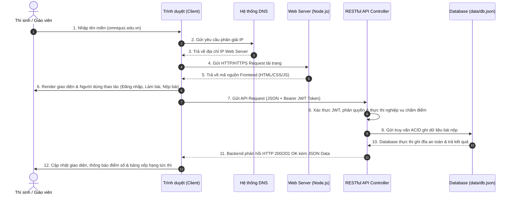

<div align="center">
  
  
  # OmniQuiz PRO — Full-Stack CBT Platform 🛡️

  **Nền tảng thi và ôn luyện trắc nghiệm chuẩn hóa Full-Stack & Hybrid CBT: Tích hợp Node.js RESTful API, CSDL ACID bền vững, xác thực bảo mật JWT, phòng thi trực tuyến mã PIN & PWA Offline.**

  <br />

  [](https://omni-quiz-harilowji.vercel.app/)
  [](https://github.com/Harilowji/OmniQuiz)
  [](docs/POST_IMPLEMENTATION_REPORT.md)
  [](Dockerfile)
  [](https://omni-quiz-harilowji.vercel.app/)
  [](LICENSE)

  <br />

  👉 **[Trải nghiệm trực tiếp tại: omni-quiz-harilowji.vercel.app](https://omni-quiz-harilowji.vercel.app/)**
</div>

---

## 🏛️ Kiến Trúc Toàn Diện Hệ Thống (9 Thành Phần Cốt Lõi)

Hệ thống OmniQuiz PRO được xây dựng theo mô hình **Full-Stack Web Architecture** tiêu chuẩn công nghiệp:

| Thành phần | Công nghệ / Triển khai trong OmniQuiz PRO | Vai trò & Chức năng |
| :--- | :--- | :--- |
| **1. Domain** | `omniquiz.edu.vn` / `localhost:3000` | Tên miền định danh giúp thí sinh và giáo viên truy cập dễ nhớ |
| **2. DNS** | Cloudflare / Vercel Edge DNS | Phân giải tên miền sang địa chỉ IP của Web Server |
| **3. Hosting / Server** | Node.js Express, Docker Container, Vercel Serverless | Môi trường lưu trữ và thực thi mã nguồn máy chủ |
| **4. Frontend** | Vanilla ES6+ SPA, HTML5, CSS3, KaTeX, PWA | Giao diện tương tác, làm bài thi, lật thẻ Flashcard, render công thức Toán |
| **5. Backend** | Node.js Express Controller, JWT PBKDF2 Auth | Tiếp nhận API, kiểm tra token, phân quyền RBAC, chấm điểm an toàn |
| **6. Database** | ACID File-Backed JSON DAL (`data/db.json`) & Cloud DB | Lưu trữ bền vững tài khoản, đề thi, lịch sử nộp bài và phòng thi PIN |
| **7. RESTful API** | HTTP/JSON Endpoints (`/api/*`) | Cầu nối giao tiếp hai chiều giữa Frontend và Backend |
| **8. SSL / HTTPS** | TLS 1.3, WeakMap Vault, PBKDF2 Salted Hashes | Mã hóa đường truyền, chống giả mạo điểm số và lộ đáp án DevTools |
| **9. CDN, Cache & Storage** | Service Worker PWA, IndexedDB, Nginx Gzip | Tối ưu tốc độ tải trang, đảm bảo làm bài ngay cả khi đứt mạng 100% |

---

## 🔄 Luồng Vận Hành 12 Bước (Request-Response Lifecycle)

Hệ thống tuân thủ nghiêm ngặt quy trình 12 bước từ yêu cầu trình duyệt đến phản hồi kết quả:



---

## ⚡ 5 Vũ Khí Cốt Lõi

* 🔒 **Bảo mật phòng thi kép (Dual-Layer CBT Security):**
  * *Client-Side:* Giấu đáp án vào `WeakMap Vault`, xóa triệt để lời giải khỏi DOM Tree khi chưa nộp bài, mã hóa storage, chống mở DevTools Console/F12.
  * *Server-Side:* Chấm điểm độc lập tại máy chủ (`/api/submissions`), mã hóa mật khẩu PBKDF2 kèm Salt ngẫu nhiên, xác thực phiên bằng chuẩn JWT Bearer.
* 🌐 **Phòng thi trực tuyến & Bảng xếp hạng mã PIN 6 số:**
  * Giáo viên tạo phòng thi với 1 click, tự động phát sinh mã PIN (vd: `888999`).
  * Thí sinh chỉ cần nhập mã PIN + Tên + SBD là vào thi ngay, điểm số tự động cập nhật lên Live Leaderboard theo thời gian thực.
* 🤖 **Gia sư AI & Quét ảnh OCR tạo đề thi (Gemini Flash):**
  * Nút "Hỏi Gia sư AI" trên từng câu: giải thích cặn kẽ bẫy đề, mẹo Casio bấm máy trong 30s.
  * Quét ảnh chụp đề/sách vở bằng Gemini Vision OCR tự động phân tích và tạo bài thi ngay lập tức.
* 🎴 **Lật thẻ 3D & Lặp lại ngắt quãng (Spaced Repetition Flashcard):**
  * Tự động biến mọi đề thi thành hệ thống Flashcard 3D; thuật toán gom câu "Chưa thuộc" để rèn luyện lặp lại ngắt quãng đến khi đạt 100% Mastery Rate.
* 📄 **Parser đa định dạng siêu bền bỉ:**
  * Hỗ trợ tải trực tiếp file PDF, Word (`.docx`), `.txt` hoặc đề mẫu; tự động sửa khoảng trắng ẩn Unicode/BOM; hiển thị công thức Toán LaTeX/KaTeX và Hóa học `mhchem`.

---

## 📡 Danh Mục RESTful API Endpoints

Mọi giao tiếp client-server đều thông qua chuẩn RESTful API với định dạng JSON:

| Phương thức | Endpoint | Chức năng | Phân quyền (Auth) |
| :--- | :--- | :--- | :--- |
| `GET` | `/api/health` | Kiểm tra trạng thái máy chủ, CSDL & Uptime | Public |
| `POST` | `/api/auth/register` | Đăng ký tài khoản mới (Học sinh / Giáo viên) | Public |
| `POST` | `/api/auth/login` | Đăng nhập hệ thống & cấp JWT Token | Public |
| `GET` | `/api/auth/me` | Lấy thông tin tài khoản hiện tại | Bearer JWT |
| `GET` | `/api/exams` | Lấy danh sách đề thi từ cơ sở dữ liệu | Public |
| `GET` | `/api/exams/:id` | Xem chi tiết đề thi (Hỗ trợ chế độ thi ẩn đáp án) | Public |
| `POST` | `/api/exams` | Giáo viên tải lên / tạo đề thi mới vào CSDL | Teacher / Admin |
| `POST` | `/api/submissions` | Nộp bài thi, chấm điểm máy chủ an toàn | Optional JWT |
| `GET` | `/api/submissions/my-history` | Lấy lịch sử thi của tài khoản đăng nhập | Bearer JWT |
| `POST` | `/api/rooms` | Khởi tạo phòng thi trực tuyến mã PIN 6 số | Public / Teacher |
| `GET` | `/api/rooms/:pin` | Thí sinh vào phòng thi bằng mã PIN | Public |
| `POST` | `/api/rooms/:pin/submit` | Nộp bài thi theo phòng thi | Public |
| `GET` | `/api/rooms/:pin/leaderboard` | Lấy bảng xếp hạng điểm số phòng thi trực tiếp | Public |
| `POST` | `/api/ai/tutor` | Proxy gia sư AI phân tích câu hỏi | Optional Key |
| `POST` | `/api/ai/ocr` | Proxy OCR trích xuất đề thi từ ảnh | Optional Key |

---

## 🚀 Hướng Dẫn Cài Đặt & Chạy Hệ Thống

### 1. Chạy với Node.js Full-Stack (Khuyến nghị)

```bash
# 1. Clone repository
git clone https://github.com/Harilowji/OmniQuiz.git
cd OmniQuiz

# 2. Cài đặt thư viện (Chỉ mất vài giây)
npm install

# 3. Khởi động máy chủ Full-Stack (Phục vụ cả Frontend SPA và REST API)
npm start
```

👉 Mở trình duyệt tại: **`http://localhost:3000`**

### ⚡ Tài khoản mẫu sẵn có trong CSDL (Demo Accounts)

Hệ thống tự động seed sẵn dữ liệu mẫu để bạn thử nghiệm ngay không cần cấu hình:
* **👨‍🏫 Tài khoản Giáo viên (Teacher / Admin):**
  * Email: `teacher@omniquiz.edu.vn`
  * Mật khẩu: `admin123`
* **🎓 Tài khoản Học sinh (Student):**
  * Email: `student@omniquiz.edu.vn`
  * Mật khẩu: `student123`
* **🌐 Phòng thi mẫu trực tuyến:** Mã PIN `888999` (Môn Toán & Tin học THPT)

---

### 2. Chạy Kiểm Thử Tự Động Toàn Diện (Automated Test Suite)

Chạy bộ test 17 ca kiểm thử đầu cuối (End-to-End) bao quát toàn bộ 12 bước vận hành:
```bash
npm test
```
*Kết quả:* `🎉 Test Suite Completed: 17 PASSED, 0 FAILED.`

---

### 3. Triển khai với Docker & Docker Compose

Chạy hệ thống trong container biệt lập nhẹ chuẩn Alpine:
```bash
# Khởi chạy ứng dụng container
docker-compose up -d --build

# Xem log hoạt động máy chủ
docker-compose logs -f
```
Hệ thống sẽ chạy tại `http://localhost:3000` với thư mục `data/` được mount ra ngoài để giữ dữ liệu bền bỉ.

---

### 4. Triển khai lên Vercel Serverless

Repository đã được cấu hình sẵn file `vercel.json` và `api/index.js`. Chỉ cần kết nối repository vào [Vercel Dashboard](https://vercel.com) hoặc chạy lệnh:
```bash
npx vercel --prod
```

---

## 📂 Cấu Trúc Mã Nguồn Dự Án

```
quiz_app/
├── api/
│   └── index.js              # Vercel Serverless Function entrypoint
├── server/
│   ├── database.js           # ACID File-Backed Data Access Layer (DAL) & Seed Data
│   ├── auth.js               # JWT HMAC-SHA256 Token & PBKDF2 Password Hashing
│   └── api.js                # Bộ điều khiển RESTful API (12-step Controller)
├── data/
│   └── db.json               # Cơ sở dữ liệu JSON bền vững (Users, Exams, Submissions, Rooms)
├── tests/
│   └── api.test.js           # Bộ test tự động kiểm thử toàn bộ 12 luồng hệ thống
├── js/
│   ├── api-client.js         # RESTful API Client kết nối Frontend với Backend
│   ├── room-manager.js       # Quản trị phòng thi mã PIN & Live Leaderboard
│   ├── ai-tutor.js           # Gia sư AI & Trích xuất đề thi từ ảnh OCR (Gemini API)
│   ├── flashcard.js          # 3D Flip Card Engine & Spaced Repetition Loop
│   ├── parser.js             # Bóc tách PDF/Word/TXT, Unicode & HTML Sanitizer
│   ├── quiz-engine.js        # State machine, WeakMap Vault, Timer & Pacing
│   ├── storage.js            # Dual-layer IndexedDB + LocalStorage + Backend Sync
│   ├── ui.js                 # DOM Renderer, KaTeX typesetting & Question Map
│   └── app.js                # Main orchestrator & Anti-Cheat monitor
├── server.js                 # Node.js Express Production Server
├── Dockerfile                # Docker container configuration (Node.js 20 Alpine)
├── docker-compose.yml        # Docker Compose configuration
├── vercel.json               # Vercel Serverless configuration
└── index.html                # Single Page Application giao diện hiện đại
```

---

## ⌨️ Phím Tắt Tiện Ích Trong Phòng Thi

* <kbd>1</kbd> ... <kbd>4</kbd> hoặc <kbd>A</kbd> ... <kbd>D</kbd>: Chọn nhanh đáp án A, B, C, D.
* <kbd>Space</kbd>: Lật thẻ 3D xem đáp án & giải thích chi tiết (Chế độ Flashcard).
* <kbd>1</kbd> hoặc <kbd>←</kbd>: Đánh dấu thẻ "Chưa thuộc" (Lặp lại ngắt quãng).
* <kbd>2</kbd> hoặc <kbd>→</kbd>: Đánh dấu thẻ "Đã thuộc" (Tăng Mastery Rate).
* <kbd>F</kbd>: Đặt cờ / Bỏ cờ câu hỏi cần xem lại.
* <kbd>F11</kbd>: Bật / Tắt chế độ Toàn màn hình (Fullscreen CBT).
* <kbd>Esc</kbd>: Đóng nhanh modal thông báo / kết quả thi.

---

## 📄 Giấy Phép (License)

Phát hành theo giấy phép nguồn mở [MIT License](LICENSE) · Bản quyền thuộc về **[Harilowji](https://github.com/Harilowji)**.
