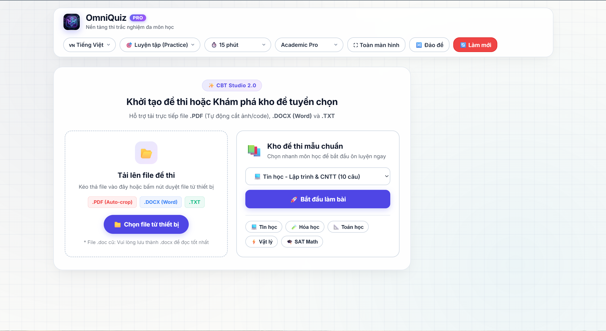
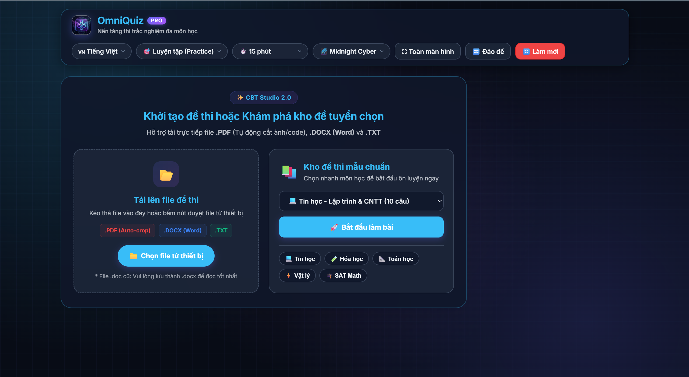
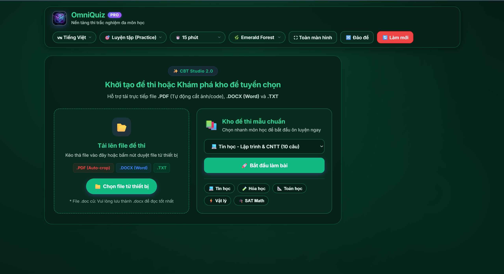
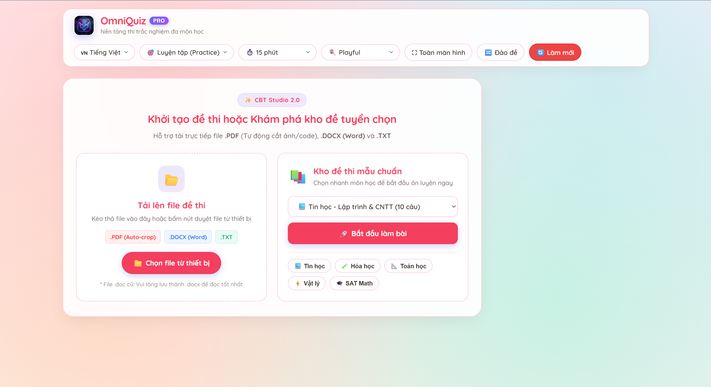
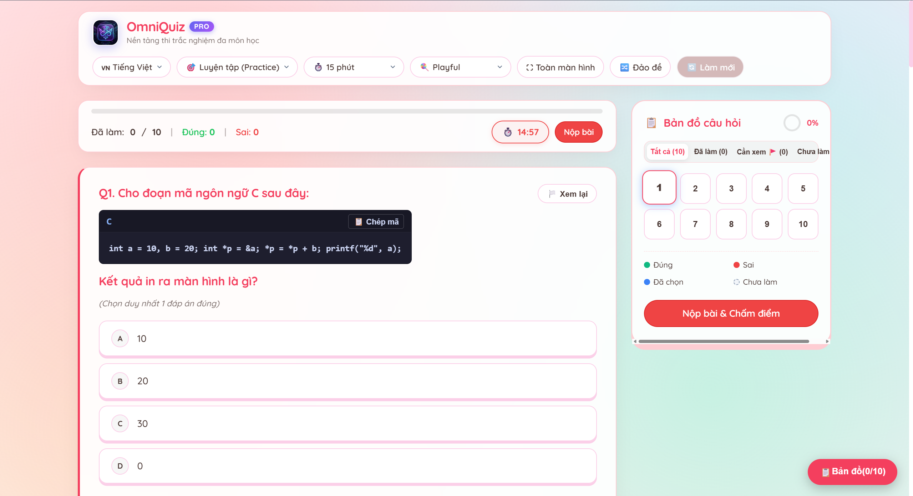
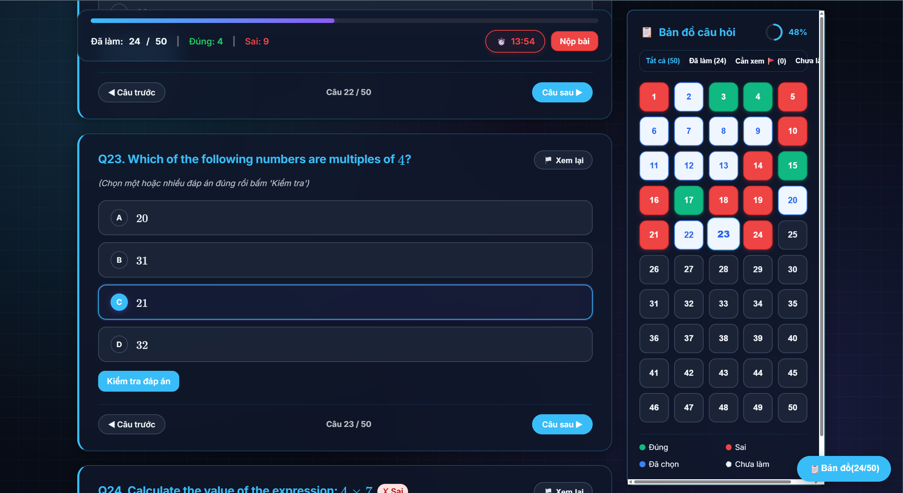
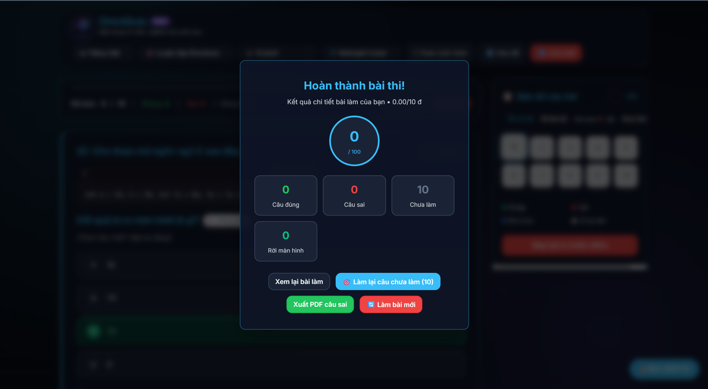
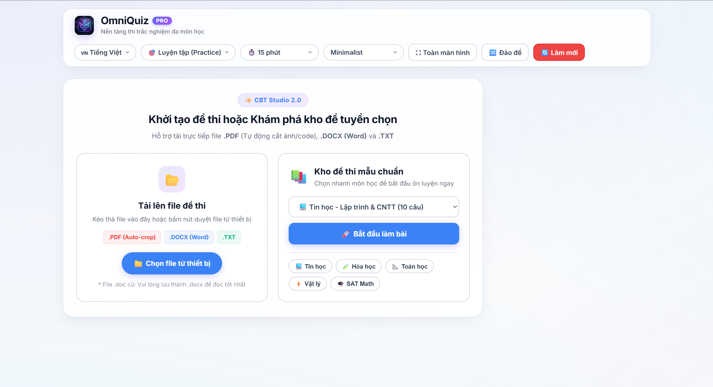

<div align="center">
  <br />
  
  
  
  # ⚡ OmniQuiz Pro 🦉

  **Hệ thống thi trắc nghiệm máy tính (CBT) không máy chủ, bảo mật tối đa và chuẩn hóa quốc tế.**
  *Universal Computer-Based Testing & Exam Preparation Platform — 100% Client-Side, Zero-Backend & PWA Offline.*

  [](https://omni-quiz-harilowji.vercel.app/)
  [](https://harilowji.github.io/OmniQuiz/)
  [](https://github.com/Harilowji/OmniQuiz)
  [](https://omni-quiz-harilowji.vercel.app/)
  [](https://omni-quiz-harilowji.vercel.app/)
  [](https://omni-quiz-harilowji.vercel.app/)
  [](LICENSE)

  <br />
</div>

## 💡 Why OmniQuiz Pro

**Luyện thi và tổ chức thi trực tuyến cần sự tự do, tốc độ tức thì và bảo mật dữ liệu tuyệt đối.**

> Khi ôn luyện cho các kỳ thi THPT Quốc Gia, Đại học hay chứng chỉ quốc tế (Digital SAT, Tin học PRF/DSA), việc phụ thuộc vào máy chủ trung gian thường dẫn đến nghẽn mạng, lộ đề thi và không hỗ trợ tốt các công thức Toán/Hóa phức tạp hay khối mã lập trình.

<div align="center">
  
</div>

**OmniQuiz Pro mang toàn bộ sức mạnh của phòng thi chuẩn hóa quốc tế trực tiếp vào trình duyệt.**

> Tự động phân tích đề từ PDF/Word, nhận diện ma trận bảng đáp án cuối trang, cắt ghép đồ thị hình ảnh tự động, hiển thị công thức LaTeX MathJax và khối mã lệnh monospaced — tất cả xử lý hoàn toàn nội bộ (100% Client-Side), không cần cài đặt máy chủ.

<div align="center">
  <a href="https://harilowji.github.io/OmniQuiz/">
    
  </a>
</div>


## ⚡ Highlights

<table>
  <tr>
    <td width="50%">
      <h3>🔒 100% Client-Side & Bảo Mật</h3>
      <p>Không gửi đề thi hay dữ liệu người dùng lên bất kỳ server nào. Toàn bộ giải mã PDF/DOCX, chấm điểm và lưu tiến độ diễn ra trực tiếp trên trình duyệt qua WebAssembly và LocalStorage.</p>
    </td>
    <td width="50%">
      <h3>📄 Bóc Tách PDF & Word Tự Động</h3>
      <p>Tự động quét ma trận bảng đáp án cuối tài liệu (<code>1.A 2.B 3.C</code>), trích xuất văn bản từ Word kèm hình ảnh và tự động cắt đồ thị, sơ đồ từ PDF gắn tương ứng từng câu hỏi.</p>
    </td>
  </tr>
  <tr>
    <td width="50%">
      <h3>📐 Đa Môn: LaTeX, Hóa Học & Mã Lệnh</h3>
      <p>Tích hợp MathJax 3 rendering công thức tích phân, ma trận; tiện ích <code>mhchem</code> cho phương trình ion hóa; khối mã nguồn lập trình monospaced (C, C++, Python, Pascal) kèm nút sao chép 1-chạm.</p>
    </td>
    <td width="50%">
      <h3>🛡️ Giám Sát Phòng Thi (Anti-Cheat)</h3>
      <p>Giám sát chuyển đổi tab/cửa sổ với cảnh báo âm thanh, khóa sao chép câu hỏi, ngăn chặn chuột phải và tự động thu bài thi khi thí sinh vi phạm quá số lần quy định.</p>
    </td>
  </tr>
  <tr>
    <td width="50%">
      <h3>🎯 Ôn Luyện Lại Câu Sai & Xuất PDF</h3>
      <p>Phân tích điểm số chi tiết với circular gauge. Tự động tạo phiên ôn tập mới chỉ từ các câu làm sai với 1-chạm, hoặc kết xuất toàn bộ phiếu bài làm sai kèm lời giải thành file PDF.</p>
    </td>
    <td width="50%">
      <h3>📶 PWA Offline & Chuẩn WCAG 2.1 AA</h3>
      <p>Service Worker thông minh cho phép cài đặt web như ứng dụng native và làm bài thi hoàn toàn không cần Internet. Hỗ trợ điều hướng phím tắt và bàn phím chuyên nghiệp.</p>
    </td>
  </tr>
</table>


## 🖥️ Interface & Dynamic Themes

<table>
  <tr>
    <td width="50%" align="center">
      
      <p><b>🏛️ Academic Pro (Mặc định)</b><br />Không gian học thuật trang nhã, lưới toạ độ chìm chuyển động êm dịu.</p>
    </td>
    <td width="50%" align="center">
      
      <p><b>⚡ Midnight Cyber (Dark Mode)</b><br />Gam màu Cyan Neon công nghệ cao, tối ưu làm bài thi ban đêm.</p>
    </td>
  </tr>
  <tr>
    <td width="50%" align="center">
      
      <p><b>🌲 Emerald Forest</b><br />Sắc xanh lục sinh thái tự nhiên, giảm mỏi mắt khi luyện đề lâu dài.</p>
    </td>
    <td width="50%" align="center">
      
      <p><b>🍬 Playful Candy</b><br />Tone pastel ngọt ngào tươi sáng, xua tan áp lực tâm lý phòng thi.</p>
    </td>
  </tr>
  <tr>
    <td width="50%" align="center">
      
      <p><b>💻 Informatics Code Engine</b><br />Khối mã lệnh C/C++/Python sắc nét kèm nút copy 1-chạm.</p>
    </td>
    <td width="50%" align="center">
      
      <p><b>🗺️ Question Palette Matrix</b><br />Bản đồ phân màu trạng thái thời gian thực và % tiến độ tròn.</p>
    </td>
  </tr>
  <tr>
    <td width="50%" align="center">
      
      <p><b>📊 Result Dashboard & Stats</b><br />Gauge chấm điểm tròn, thống kê chi tiết câu đúng/sai/bỏ qua.</p>
    </td>
    <td width="50%" align="center">
      
      <p><b>☀️ Minimalist Light</b><br />Tờ đề thi giấy trắng chuẩn quốc tế, độ tương phản cao sắc nét.</p>
    </td>
  </tr>
</table>


## 🚀 Getting Started

Bạn có thể trải nghiệm OmniQuiz Pro theo phương thức phù hợp nhất với nhu cầu:

| Phương thức | Tệp / Địa chỉ | Phù hợp với | Mô tả |
| :--- | :--- | :--- | :--- |
| **Vercel Cloud** *(Khuyên dùng)* | [omni-quiz-harilowji.vercel.app](https://omni-quiz-harilowji.vercel.app/) | Mọi thiết bị / CDN Siêu tốc | Tải trang siêu tốc tức thì, tự động cập nhật phiên bản mới nhất từ nhánh `main`. |
| **GitHub Pages** | [harilowji.github.io/OmniQuiz](https://harilowji.github.io/OmniQuiz/) | Dự phòng / Trực tiếp | Triển khai tự động song song qua GitHub Actions CI/CD. |
| **Cài Đặt PWA** | [Trang chủ OmniQuiz](https://omni-quiz-harilowji.vercel.app/) | Offline / Di động | Nhấp nút **Install** trên thanh địa chỉ trình duyệt để cài đặt thành app máy tính/điện thoại, thi offline 100%. |
| **Docker Container** | [`docker-compose.yml`](docker-compose.yml) | Phòng máy trường học / Lab | Đóng gói Nginx Alpine siêu nhẹ (< 25MB RAM). Khởi chạy máy chủ nội bộ không cần mạng Internet ngoài. |

> [!TIP]
> **Yêu cầu hệ thống**: Mọi thiết bị có trình duyệt web hỗ trợ ES6 (Windows, macOS, Linux, iPadOS, Android). Không yêu cầu NodeJS, Python hay cơ sở dữ liệu để vận hành.

## ⌨️ Essential Shortcuts

| Phím tắt | Thao tác |
| :--- | :--- |
| <kbd>1</kbd> ... <kbd>4</kbd> hoặc <kbd>A</kbd> ... <kbd>D</kbd> | Chọn nhanh đáp án A, B, C, D |
| <kbd>←</kbd> / <kbd>→</kbd> | Chuyển tới câu hỏi Trước / Kế tiếp |
| <kbd>F</kbd> | Đánh dấu cờ câu hỏi cần xem lại (Flag) |
| <kbd>Space</kbd> / <kbd>Enter</kbd> | Kích hoạt lựa chọn đáp án (Chuẩn tiếp cận WCAG 2.1 AA) |
| <kbd>F11</kbd> | Bật / Tắt chế độ Toàn màn hình (Fullscreen CBT) |
| <kbd>Esc</kbd> | Đóng thông báo / Hộp thoại kết quả bài thi |

<details>
<summary><b>📝 Format Soạn Đề Mẫu (Quick Syntax Guide)</b></summary>

<br />

### 1. Đề thi Phổ thông (Toán - Lý - Hóa - Tiếng Anh)
```text
Câu 1: Cho hàm số y = f(x) có bảng biến thiên như hình vẽ. Số nghiệm của f(x) = 2 là:
A. 1
B. 2
C. 3
D. 4
Đáp án: C
Lời giải: Dựa vào sự tương giao đồ thị, đường thẳng y = 2 cắt đồ thị tại 3 điểm phân biệt.
```
*(Hỗ trợ đáp án nằm trên 1 hàng ngang: `A. 1   B. 2   C. 3   D. 4`)*

### 2. Đề thi có Bảng Đáp Án ở cuối tài liệu (.docx / .pdf)
```text
Câu 1: Khí nào sau đây gây ra hiệu ứng nhà kính?
A. N2          B. O2          C. CO2          D. H2

Câu 2: Công thức phân tử của Glucozơ là:
A. C6H12O6     B. C12H22O11   C. C2H4O2       D. C3H6O3

... (nội dung đề thi) ...

BẢNG ĐÁP ÁN:
1.C   2.A   3.B   4.D   5.C
```

### 3. Đề thi Tin học / Khối Mã Lệnh (Informatics)
````text
Câu 1: Cho đoạn mã C sau. Kết quả in ra màn hình là gì?
```c
int a = 10, b = 20;
int *p = &a;
*p = *p + b;
printf("%d", a);
```
A. 10
B. 20
C. 30
D. 0
Đáp án: C
````

### 4. Triển khai bằng Docker Compose
```bash
docker compose up -d
# Truy cập tại: http://localhost:8080
```

</details>

<br />

<div align="center">
  
  <br /><br />
  MIT License · Thiết kế & Phát triển với đam mê bởi <a href="https://github.com/Harilowji">Harilowji</a>
</div>
