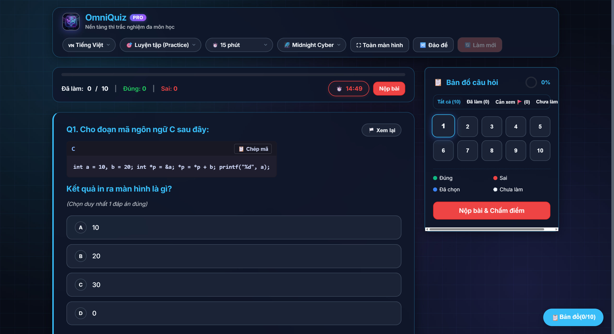

<div align="center">

  

  # ⚡ OmniQuiz Pro
  ### Nền tảng Thi Trắc nghiệm Máy tính (CBT) Đa môn & Tự do 100% Client-Side
  *Universal Computer-Based Testing Platform — Zero-Backend, Zero-Setup, Privacy-First & PWA Offline*

  <p>
    <a href="https://harilowji.github.io/OmniQuiz/"></a>
    
    
    
    
    
  </p>

  <br>

  <!-- Hero Image -->
  <a href="https://harilowji.github.io/OmniQuiz/">
    
  </a>
  
  <p align="center">
    <i>Giao diện Landing Studio với <b>Dual-Zone Upload</b> kéo thả file tự động & Ngân hàng Đề thi Curated phong phú</i>
  </p>

</div>

---

## ⚡ Điểm Khác Biệt Cốt Lõi (Core Highlights)

<table>
  <tr>
    <td width="50%">
      <h3>🔒 100% Client-Side & Bảo mật</h3>
      Toàn bộ dữ liệu thi, tài liệu Word/PDF và tiến độ được xử lý trực tiếp trên trình duyệt bằng WebAssembly & Vanilla JS. Không tải dữ liệu lên máy chủ ngoài, an toàn tuyệt đối.
    </td>
    <td width="50%">
      <h3>📄 Tự Động Bóc Tách PDF & Word (.docx)</h3>
      Tự động nhận diện bảng đáp án cuối trang (ma trận <code>1.A 2.B 3.C</code>), đọc file Word kèm ảnh minh họa và trích xuất hình vẽ, đồ thị từ file PDF gắn tương ứng từng câu hỏi.
    </td>
  </tr>
  <tr>
    <td width="50%">
      <h3>📐 Đa Môn Học: Toán, Hóa & Lập Trình</h3>
      Tích hợp MathJax 3 (LaTeX), <code>mhchem</code> (phương trình hóa học ion) và khối mã nguồn C, C++, Python, Pascal với cú pháp monospaced cùng nút sao chép 1-chạm.
    </td>
    <td width="50%">
      <h3>🛡️ Giám Sát Phòng Thi (Anti-Cheat)</h3>
      Theo dõi chuyển tab/cửa sổ với bộ đếm vi phạm, phát âm thanh cảnh báo, ngăn chặn sao chép câu hỏi, khóa chuột phải và chế độ Toàn màn hình (Fullscreen).
    </td>
  </tr>
</table>

---

## 🎨 5 Giao Diện Động Đẳng Cấp (Dynamic Animated Themes)

OmniQuiz Pro được trang bị 5 bộ giao diện với bảng màu tuyển chọn kỹ lưỡng, hỗ trợ học tập và thi cử thoải mái trong mọi điều kiện ánh sáng:

<table>
  <tr>
    <td align="center" width="50%">
      <b>🏛️ Academic Pro (Mặc định Học thuật)</b><br><br>
      <br>
      <i>Phối màu Indigo/Slate nhã nhặn, lưới toạ độ chuyển động êm dịu</i>
    </td>
    <td align="center" width="50%">
      <b>⚡ Midnight Cyber (Dark Mode Công nghệ)</b><br><br>
      <br>
      <i>Gam màu Cyan Neon sắc nét, tối ưu làm bài thi ban đêm</i>
    </td>
  </tr>
  <tr>
    <td align="center" width="50%">
      <b>🌲 Emerald Forest (Xanh Sinh thái Dịu mắt)</b><br><br>
      <br>
      <i>Sắc xanh lục mát mẻ, xua tan cảm giác mỏi mắt khi luyện đề lâu</i>
    </td>
    <td align="center" width="50%">
      <b>🍬 Playful Candy (Kẹo Ngọt Năng động)</b><br><br>
      <br>
      <i>Tone hồng tím pastel ngọt ngào, tạo cảm hứng học tập tích cực</i>
    </td>
  </tr>
  <tr>
    <td align="center" colspan="2">
      <b>☀️ Minimalist Light (Tối giản Thanh lịch)</b><br><br>
      <br>
      <i>Mô phỏng tờ đề thi giấy tiêu chuẩn quốc tế, độ tương phản cao</i>
    </td>
  </tr>
</table>

---

## 🚀 Trải Nghiệm Làm Bài & Quản Lý Đề Thi

<table>
  <tr>
    <td width="55%" valign="top">
      <h3>💻 Phòng Thi Trực Quan & Khối Lập Trình</h3>
      <ul>
        <li><b>Khối Code Monospaced:</b> Tự động nhận diện mã C, C++, Python, Java với nút sao chép 1-chạm (<code>📋 Chép mã</code>).</li>
        <li><b>Nhiều loại câu hỏi:</b> Một đáp án, nhiều đáp án (Multiple-choice check), câu hỏi trích xuất từ PDF/Word.</li>
        <li><b>Bản đồ câu hỏi (Palette):</b> Hiển thị % tiến độ tròn, trạng thái phân màu thông minh.</li>
      </ul>
      
    </td>
    <td width="45%" valign="top">
      <h3>🗺️ Ma Trận Bản Đồ Phân Màu Thời Gian Thực</h3>
      <ul>
        <li><b>Mã màu chuẩn CBT:</b> Đúng 🟢, Sai 🔴, Đã chọn 🔵, Chưa làm ⚪, Đánh dấu xem lại 🚩.</li>
        <li>Bộ lọc phân đoạn (Segmented Control) lọc tức thì các câu cần xem lại hoặc chưa làm.</li>
        <li>Chế độ <b>Luyện tập:</b> Kiểm tra ngay với Web Audio Synth (ding/buzz) kèm lời giải.</li>
      </ul>
      
    </td>
  </tr>
</table>

<table>
  <tr>
    <td width="50%" valign="top">
      <h3>🎯 Bảng Điểm & Thống Kê Chi Tiết</h3>
      <ul>
        <li>Gauge vòng tròn hiển thị điểm số trên thang điểm 10 & 100.</li>
        <li>Thống kê rõ ràng: <b>Câu đúng</b>, <b>Câu sai</b>, <b>Chưa làm</b>, <b>Số lần rời màn hình</b>.</li>
        <li>Pháo hoa chúc mừng (Canvas Confetti) khi đạt kết quả cao.</li>
      </ul>
      
    </td>
    <td width="50%" valign="top">
      <h3>📥 Luyện Lại Câu Sai & Xuất PDF Phiếu Lỗi</h3>
      <ul>
        <li><b>🎯 Làm lại câu chưa làm / Làm lại câu sai:</b> Tạo ngay phiên ôn tập tập trung chỉ từ các câu làm sai chỉ với 1 nút bấm.</li>
        <li><b>📄 Xuất PDF câu sai:</b> Tự động tạo file PDF tổng hợp các câu sai kèm đáp án chuẩn và lời giải chi tiết.</li>
      </ul>
      
    </td>
  </tr>
</table>

---

## 📝 Cú Pháp Soạn Đề Siêu Tốc (Quick Syntax Guide)

<details open>
<summary><b>1. Đề thi Phổ thông / Toán - Lý - Hóa - Anh (Khuyên dùng)</b></summary>
<br>

```text
Câu 1: Cho hàm số y = f(x) có bảng biến thiên như hình vẽ. Số nghiệm của f(x) = 2 là:
A. 1
B. 2
C. 3
D. 4
Đáp án: C
Lời giải: Dựa vào sự tương giao đồ thị, đường thẳng y = 2 cắt đồ thị tại 3 điểm phân biệt.
```
*(Hỗ trợ đáp án nằm trên 1 dòng ngang: `A. 1   B. 2   C. 3   D. 4` hoặc `[A] 1 [B] 2...`)*
</details>

<details>
<summary><b>2. Đề thi có Bảng Đáp Án ở cuối tài liệu (.docx / .pdf)</b></summary>
<br>

```text
Câu 1: Khí nào sau đây gây ra hiệu ứng nhà kính?
A. N2          B. O2          C. CO2          D. H2

Câu 2: Công thức phân tử của Glucozơ là:
A. C6H12O6     B. C12H22O11   C. C2H4O2       D. C3H6O3

... (nội dung đề thi) ...

BẢNG ĐÁP ÁN:
1.C   2.A   3.B   4.D   5.C
```
</details>

<details>
<summary><b>3. Đề thi Tin học / Khối Mã Lệnh (Informatics Code Blocks)</b></summary>
<br>

````text
Câu 1: Cho đoạn mã C sau. Kết quả in ra màn hình là gì?
```c
int a = 10, b = 20;
int *p = &a;
*p = *p + b;
printf("%d", a);
```
A. 10
B. 20
C. 30
D. 0
Đáp án: C
Lời giải: Con trỏ p trỏ tới a, phép gán *p = *p + b tương đương a = a + b = 30.
````
</details>

---

## ⚡ Khởi Chạy Nhanh (Quick Start)

<table>
  <tr>
    <td width="50%">
      <h3>🌐 Cách 1: Chạy Trực Tiếp (Không Cần Cài Đặt)</h3>
      1. Tải repository hoặc clone về máy.<br>
      2. Mở trực tiếp file <code>index.html</code> trên mọi trình duyệt web.<br>
      3. Kéo thả file đề thi vào hoặc chọn một trong các bộ đề mẫu có sẵn!
    </td>
    <td width="50%">
      <h3>🐳 Cách 2: Chạy Bằng Docker / Compose</h3>
      <pre><code># Khởi chạy tức thì (< 25MB RAM)
docker compose up -d

# Mở trình duyệt truy cập:
http://localhost:8080</code></pre>
    </td>
  </tr>
</table>

---

## 🛠️ Công Nghệ & Tiêu Chuẩn (Tech Stack)

<div align="center">

| Hạng mục | Công nghệ / Thư viện | Tính năng nổi bật |
| :--- | :--- | :--- |
| **Kiến trúc Core** | Vanilla HTML5 / CSS3 / ES6+ | Siêu nhẹ, nạp tức thì, không bundle cồng kềnh |
| **Toán học & Hóa học** | MathJax 3.2 + `mhchem` | Render mượt LaTeX, tích phân, ma trận, công thức hóa học |
| **Xử lý Tài liệu** | PDF.js + Mammoth.js | Phân tích PDF & Word trực tiếp, tự động bóc tách ảnh minh họa |
| **Chuẩn tiếp cận** | WCAG 2.1 AA | Điều hướng bàn phím hoàn toàn (`Tab`, `Space`, `Enter`), ARIA |
| **Offline Engine** | Progressive Web App (PWA) | Service Worker cache toàn diện, thi ngoại tuyến không cần mạng |
| **Âm thanh** | Web Audio API + HTML5 Audio | Bộ phát âm thanh trực tiếp (ding/buzz) không phụ thuộc file ngoài |
| **Báo cáo & PDF** | html2pdf.js + Canvas Confetti | Tạo file PDF phiếu câu sai, pháo hoa mừng điểm cao |

</div>

---

<div align="center">

  <b>OmniQuiz Pro</b> • Phát triển với đam mê vì nền giáo dục trực tuyến chất lượng cao & dễ tiếp cận.<br>
  Được phát hành dưới giấy phép mã nguồn mở **[MIT License](LICENSE)**.

  <sub>Tác giả: <a href="https://github.com/Harilowji">Harilowji</a> • Built with Google DeepMind Antigravity Pair-Programming Assistant</sub>

</div>
