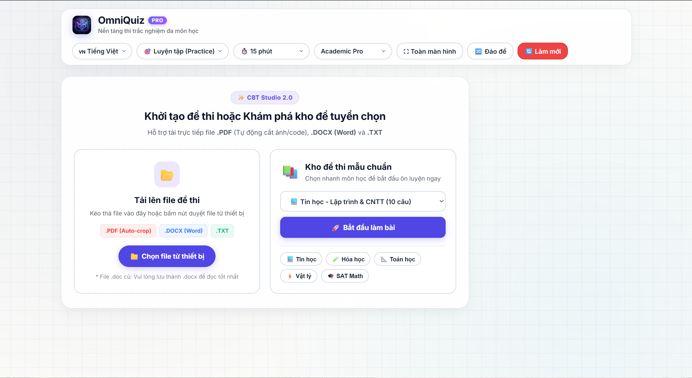
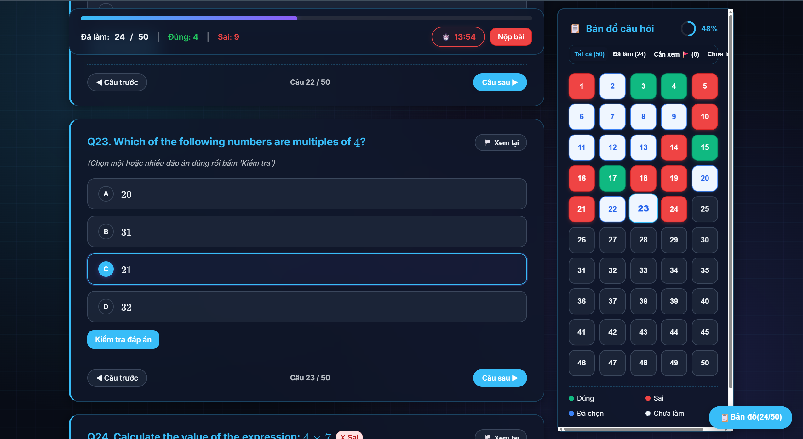
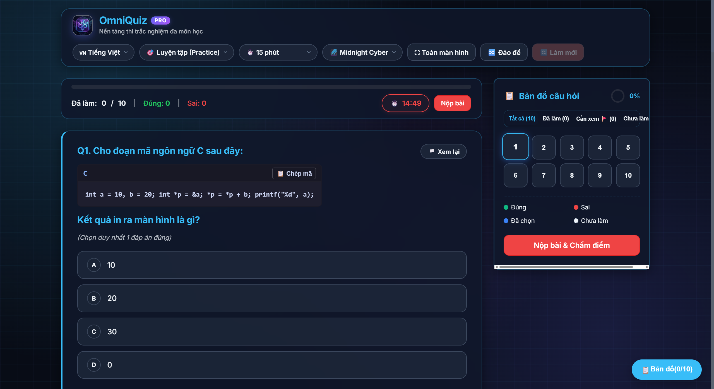
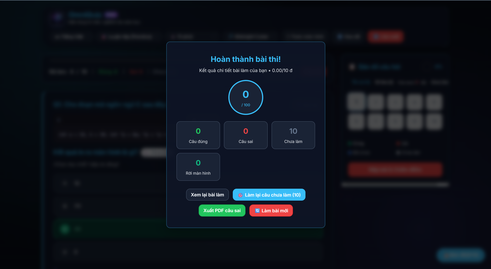
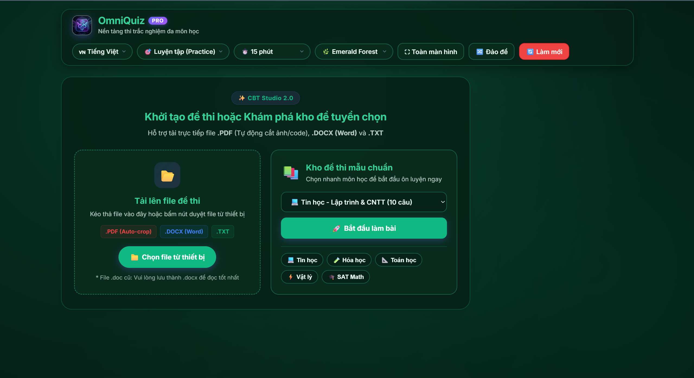
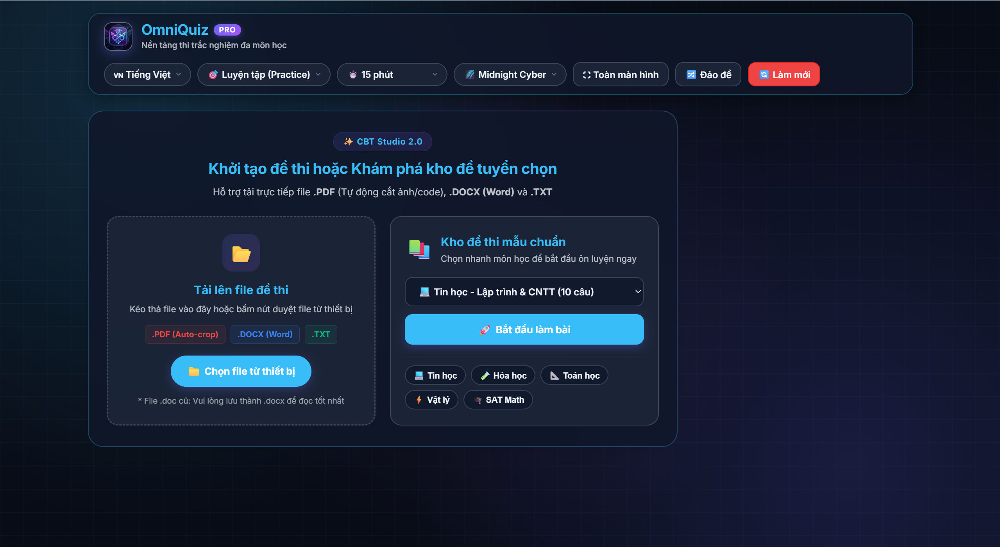
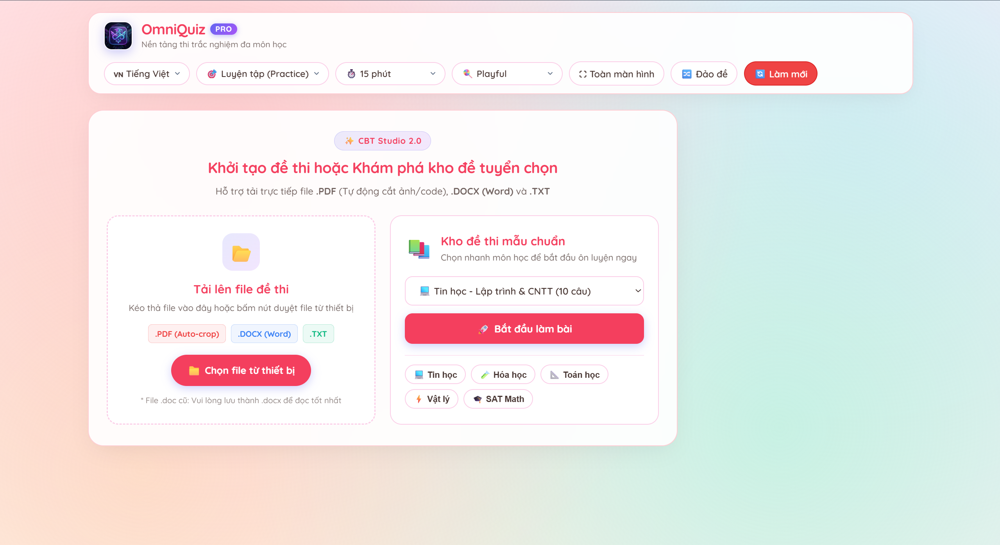
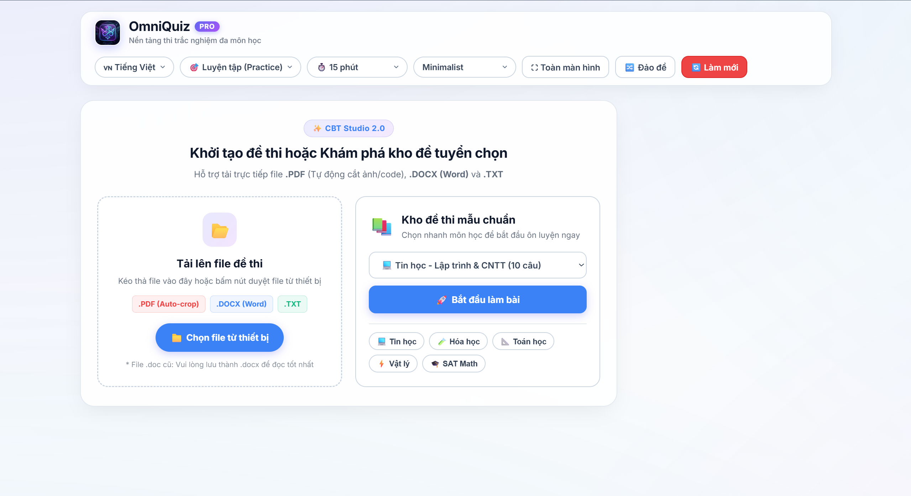

<div align="center">

  

  <br /><br />

  

  <br /><br />

  <h3>⚡ Next-Gen Computer-Based Testing & Study Intelligence Platform</h3>

  <p><strong>Nền tảng khảo thí trực tuyến & rèn luyện trắc nghiệm chuẩn hóa cấp doanh nghiệp (Enterprise EdTech Standard)</strong><br />
  Kiến trúc Local-First · Tri-Mode Suite (Exam / Practice / 3D Flashcard SM-2) · Multi-Format Web Worker Parser 3.0 · CBT Proctoring 3 Cấp Độ · Supabase Realtime PIN Rooms · Radar Analytics & PDF Export</p>

  <br />

  [](https://omni-quiz-harilowji.vercel.app/)
  [](tsconfig.json)
  [](vite.config.ts)
  [](tests/)
  [](src/features/realtime/)
  [](src/shared/storage/)
  [](src/features/proctoring/)
  [](LICENSE)

  <br /><br />

  👉 **[Trải nghiệm trực tiếp tại: https://omni-quiz-harilowji.vercel.app](https://omni-quiz-harilowji.vercel.app/)** 👈

</div>

<div align="center">
  
</div>

## 📸 Visual Tour & Trải Nghiệm Giao Diện (Product Showcase)

Dưới đây là hình ảnh thực tế từ nền tảng **OmniQuiz PRO (CBT Studio 2.0)** qua từng chế độ vận hành:

### 1. 🗂️ Trung Tâm Khởi Tạo & Nạp Đề Thi Đa Định Dạng (CBT Studio 2.0 Upload Hub)
> Giao diện khởi tạo chuẩn mực (`IDLE State`), giải quyết triệt để vấn đề rò rỉ giao diện hay tự động hiển thị câu hỏi khi chưa nạp đề. Hỗ trợ nạp file siêu tốc hoặc chọn trực tiếp từ **9 bộ đề mẫu chuẩn hóa** (Toán THPT, Tin học, Hóa học 40 câu, Digital SAT Math, Lịch sử, Địa lý...).

<div align="center">
  
</div>

* **Tính năng nổi bật:**
  * Kéo & thả tài liệu định dạng **PDF, Word (`.docx`), TXT, JSON**.
  * Chế độ **Web Worker Parser 3.0** tự động bóc tách sơ đồ / hình ảnh từ file Word (`word/media/`), nhận diện công thức Toán LaTeX và bảng đáp án cuối tài liệu.
  * Lựa chọn nhanh chế độ học tập: **Khảo thí bấm giờ (Exam)**, **Luyện tập loại suy (Practice)**, hoặc **Lật thẻ 3D (Flashcard)**.

---

### 2. 📝 Phòng Thi Chuẩn Hóa & Bảng Điều Hướng Câu Hỏi (CBT Exam Interface & Palette)
> Mô phỏng phòng thi trực tuyến tiêu chuẩn quốc tế (Digital SAT / ACT / THPT Quốc Gia). Bố cục chia cột tối ưu, tích hợp bảng điều hướng trạng thái câu hỏi thời gian thực.

<div align="center">
  
</div>

* **Tính năng nổi bật:**
  * **Question Palette trực quan:** Nhận diện 4 trạng thái câu hỏi rõ ràng: *Đã làm* (Xanh lục), *Chưa làm* (Trắng xám), *Đánh dấu cờ cần xem lại* (Hổ phách/Vàng cờ), và *Câu đang thao tác* (Viền sáng).
  * **Đồng hồ đếm ngược thông minh (Pacing Timer):** Cảnh báo màu trực quan khi sắp hết thời gian thi.
  * **Bảo mật phòng thi tuyệt đối:** Đáp án được cô lập hoàn toàn trong `WeakMap Vault`, xóa bỏ hoàn toàn dấu vết đáp án khỏi DOM Tree khi chưa hoàn thành bài thi.

---

### 3. 🌙 Chế Độ Midnight Cyber & Hiển Thị Code Snippets Chuẩn IDE
> Trải nghiệm làm bài thi lập trình và khoa học tự nhiên đỉnh cao với chế độ nền tối Cyberpunk dịu mắt và bộ highlight cú pháp đa ngôn ngữ.

<div align="center">
  
</div>

* **Tính năng nổi bật:**
  * **Syntax Highlighting chuẩn IDE:** Tự động định dạng mã nguồn (Python, C++, Java, JavaScript, SQL...) với phông chữ `JetBrains Mono` sắc nét.
  * **Công thức Toán KaTeX & Ký hiệu Hóa học:** Biên dịch công thức toán phức tạp, ma trận, tích phân và công thức hóa học hữu cơ theo thời gian thực mà không giật lag.
  * **Chế độ gạch bỏ loại suy (`Strikethrough / Elimination`):** Thí sinh có thể click nút `̶S̶` hoặc nhấn phím <kbd>E</kbd> để gạch bỏ các phương án sai, giảm tải nhận thức khi làm bài.

---

### 4. 📊 Phân Tích Kết Quả Thi Chuyên Sâu & Xuất Phiếu Điểm (Exam Analytics & Results)
> Đánh giá chi tiết năng lực học sinh sau khi hoàn thành bài thi với bảng thống kê đa chiều và biểu đồ trực quan.

<div align="center">
  
</div>

* **Tính năng nổi bật:**
  * **Điểm số & Thống kê tốc độ:** Hiển thị điểm số quy đổi, số câu đúng/sai, độ chính xác (%) và thời gian làm bài trung bình từng câu (Pacing Analysis).
  * **Báo cáo ma trận chuyên đề:** Phân tích độ thuần thục theo từng chủ đề kiến thức giúp phát hiện điểm yếu để cải thiện.
  * **Xuất PDF chất lượng cao:** Xuất phiếu kết quả bài thi chuẩn in ấn dạng PDF với 1 click qua `jspdf`.

---

### 5. 🎨 Hệ Thống 4 Bộ Giao Diện Đa Sắc Thái (Adaptive Theme System)
> Tùy biến không gian học tập theo cảm xúc cá nhân với 4 bảng màu được nghiên cứu công thái học:

| 🌿 **Emerald Academy** | 🌌 **Midnight Cyber** |
| :---: | :---: |
|  |  |
| *Tươi sáng, thanh lịch, tăng độ tập trung học đường* | *Độ tương phản cao, hiện đại, tối ưu cho môi trường ánh sáng yếu* |

| 🍬 **Playful Pastel** | ❄️ **Minimalist Clean** |
| :---: | :---: |
|  |  |
| *Gam màu kẹo ngọt sinh động, tạo cảm hứng ôn tập nhẹ nhàng* | *Gọn gàng, tinh giản tuyệt đối, giảm mọi phân tâm* |

<div align="center">
  
</div>

## 🏛️ Kiến Trúc Hệ Thống (Feature-Sliced Architecture & System Design)

Dự án được tái cấu trúc triệt để theo kiến trúc doanh nghiệp **Feature-Sliced Architecture (FSA)**, phân tách hoàn toàn các tầng nghiệp vụ, giao diện, lưu trữ và luồng xử lý nền:

```mermaid
flowchart TD
    subgraph UI_Layer["🖥️ Frontend Application (Vite 8 + TS Strict)"]
        Landing["IDLE Landing Hub<br/>(#upload-section)"]
        ExamView["CBT Exam View<br/>(Split-View / Palette)"]
        PracticeView["Practice View<br/>(Elimination / Instant Tip)"]
        FlashcardView["3D Flashcards<br/>(SM-2 Algorithm)"]
        AnalyticsModal["Post-Exam Analytics<br/>(Radar Chart & PDF)"]
    end

    subgraph Worker_Layer["⚡ Web Worker Pipeline (Dedicated Thread)"]
        DocWorker["workers/document-parser.worker.ts"]
        MammothEngine["Mammoth Engine (DOCX)"]
        JSZipEngine["JSZip Media Unpacker (Images)"]
        PDFJsEngine["PDF.js Extractor (PDF)"]
        RegexEngine["Passage & Answer Key Matcher"]
    end

    subgraph Security_Layer["🛡️ Integrity & Proctoring Core"]
        ProctoringService["Proctoring Engine (3 Violations)"]
        WeakMapVault["WeakMap Memory Vault (Anti-DevTools)"]
        EventShield["Keyboard & Context Blockers"]
    end

    subgraph Data_Layer["💾 Local-First Persistence & Realtime"]
        DexieDB[("Dexie.js IndexedDB<br/>(2s Auto-Save Checkpoints)")]
        SupabaseRealtime["Supabase Realtime<br/>(PIN Room Broadcast & Presence)"]
        RESTBackend["Node.js Express API<br/>(ACID JSON DAL & JWT)"]
    end

    Landing -->|Tải tệp tin DOCX/PDF/TXT| DocWorker
    DocWorker --> JSZipEngine
    DocWorker --> MammothEngine
    DocWorker --> PDFJsEngine
    DocWorker --> RegexEngine
    DocWorker -->|Trả mảng Question[]| UI_Layer

    ExamView -.->|Bảo vệ toàn vẹn| Security_Layer
    UI_Layer <-->|Tự động lưu bài làm mỗi 2s| DexieDB
    UI_Layer <-->|Đồng bộ phòng thi mã PIN| SupabaseRealtime
    UI_Layer <-->|Xác thực & nộp bài tập trung| RESTBackend
```

---

## ⚡ 7 Trụ Cột Tính Năng Đột Phá (Core Capabilities)

### 1. 🛡️ CBT Proctoring Engine (Hệ Thống Giám Thị Số 3 Cấp Độ)
* **Cấp độ 1 (Level 1 - Banner cảnh báo):** Khi thí sinh chuyển tab hoặc mất tiêu điểm cửa sổ (`blur`), thanh thông báo cảnh báo tức thì xuất hiện kèm số lần vi phạm.
* **Cấp độ 2 (Level 2 - Tạm dừng & Modal cảnh cáo):** Khi tái diễn vi phạm hoặc thoát chế độ toàn màn hình (`Fullscreen`), bài thi bị tạm dừng cưỡng bức, yêu cầu xác nhận quay lại trạng thái toàn màn hình.
* **Cấp độ 3 (Level 3 - Hủy tư cách & Thu bài tự động):** Khi vượt quá số lần vi phạm cho phép (mặc định 3 lần), hệ thống lập tức khóa bài thi và kích hoạt cơ chế nộp bài cưỡng bức.
* **Bảo vệ phòng thi Client-Side:** Chặn phím tắt mở DevTools (<kbd>F12</kbd>, <kbd>Ctrl</kbd>+<kbd>Shift</kbd>+<kbd>I</kbd>), chặn chuột phải `contextmenu`, chặn sao chép nội dung câu hỏi.

---

### 2. 📄 Multi-Format Web Worker Parser 3.0 (Bộ Bóc Tách Đa Luồng Độc Lập)
* **Xử lý tệp DOCX nâng cao:** Sử dụng `mammoth` kết hợp với `jszip` để giải nén trực tiếp thư mục `word/media/`, bóc tách toàn bộ hình ảnh và sơ đồ minh họa câu hỏi, mã hóa base64 an toàn gắn liền với từng câu trắc nghiệm.
* **Bóc tách PDF thông minh:** Phân tích cấu trúc trang qua `pdfjs-dist`, xử lý font chữ tiếng Việt, tự động nhận dạng bảng đáp án trắc nghiệm ở cuối tài liệu (ví dụ: `1.A  2.B  3.C...`).
* **Hỗ trợ bài đọc hiểu liên kết (Reading Passages):** Tự động liên kết đoạn văn đọc hiểu chung với nhóm câu hỏi con liên quan.
* **Zero UI Freeze:** Toàn bộ quá trình giải nén, parse text và ánh xạ đáp án diễn ra trên **Dedicated Web Worker**, đảm bảo giao diện web luôn đạt chuẩn 60-120 FPS không giật lag.

---

### 3. 🎯 Tri-Mode Study Suite (Bộ 3 Chế Độ Khảo Thí & Rèn Luyện)
* **1. Chế độ Khảo thí Bấm giờ (CBT Exam Mode):**
  * Mô phỏng kỳ thi chính thức: giấu đáp án tuyệt đối trong `WeakMap Vault`, đồng hồ đếm ngược có âm thanh cảnh báo, Question Palette hiển thị trạng thái hoàn thành.
* **2. Chế độ Luyện tập Tự do (Practice Mode):**
  * Hiển thị giải thích chi tiết ngay sau khi chọn đáp án.
  * **Công cụ gạch loại suy (`̶S̶` / <kbd>E</kbd>):** Cho phép học sinh gạch bỏ các phương án gây nhiễu để tập trung vào các phương án tiềm năng.
* **3. Chế độ Lật Thẻ 3D & Ôn Tập Ngắt Quãng (Flashcards & SM-2):**
  * Tự động biến mọi bộ đề thi thành các thẻ lật 3D sống động.
  * Tích hợp **thuật toán SuperMemo SM-2** tính toán hệ số ghi nhớ ($EF$), phân loại câu *Chưa thuộc* (Hard) và *Đã thuộc* (Easy), tự động xếp lịch ôn tập theo đường cong lãng quên Ebbinghaus.

---

### 4. 🌐 Phòng Thi Trực Tuyến Mã PIN 6 Số & Realtime Leaderboard
* Giáo viên hoặc nhóm học tập có thể khởi tạo phòng thi trực tiếp chỉ với 1 click, hệ thống tự động cấp mã PIN 6 số (ví dụ: `888999`).
* Thí sinh nhập mã PIN để gia nhập phòng thi ngay lập tức mà không cần cài đặt phần mềm.
* Kết nối kênh **Supabase Realtime (Presence & Broadcast)** hiển thị danh sách thí sinh đang trực tuyến và tự động cập nhật bảng xếp hạng điểm số (Live Leaderboard) theo thời gian thực.

---

### 5. 💾 Local-First & Khả Năng Hoạt Động Ngoại Tuyến (Dexie.js IndexedDB)
* Hệ thống tự động ghi nhận mọi thao tác chọn đáp án, đánh dấu cờ và thời gian còn lại vào cơ sở dữ liệu trình duyệt **Dexie.js (IndexedDB)** mỗi 2 giây.
* Trong trường hợp mất kết nối mạng đột ngột, cúp điện hoặc người dùng vô tình tải lại trang (<kbd>F5</kbd>), toàn bộ bài thi được khôi phục 100% chính xác ngay khi mở lại.

---

### 6. 📊 Phân Tích Radar Ma Trận Năng Lực & Xuất Báo Cáo PDF
* **Biểu đồ Radar Chart (Chart.js):** Đánh giá độ thành thạo đa chiều theo từng chuyên đề/dạng bài, giúp thí sinh nhìn rõ điểm mạnh và lổ hổng kiến thức.
* **Thống kê tốc độ làm bài (Pacing Matrix):** Phân tích thời gian tiêu tốn trên từng câu hỏi, cảnh báo các câu thí sinh bị sa đà mất quá nhiều thời gian.
* **Xuất PDF phiếu điểm chuẩn hóa:** Tích hợp `jspdf` định dạng bố cục trang in thẩm mỹ, hỗ trợ xuất và in phiếu kết quả bài thi ngay sau khi nộp.

---

### 7. 📱 Thiết Kế Thích Ứng Di Động Hoàn Hảo (Adaptive Bottom Sheet)
* Giao diện tương thích 100% từ màn hình Ultra-Wide, Laptop đến máy tính bảng và điện thoại di động.
* Trên thiết bị màn hình nhỏ, Question Palette tự động chuyển đổi thành **Mobile Bottom Sheet** mượt mà, hỗ trợ thao tác vuốt chạm vuốt mở tự nhiên.

<div align="center">
  
</div>

## 📡 Danh Mục RESTful API & Supabase Endpoints

Hệ thống hỗ trợ cả chế độ Serverless độc lập và máy chủ Full-Stack Node.js Express với các API tiêu chuẩn:

| Phương thức | Endpoint | Chức năng | Phân quyền (Auth) |
| :--- | :--- | :--- | :--- |
| `GET` | `/api/health` | Kiểm tra trạng thái máy chủ, CSDL & Uptime | Public |
| `POST` | `/api/auth/register` | Đăng ký tài khoản mới (Học sinh / Giáo viên) | Public |
| `POST` | `/api/auth/login` | Đăng nhập hệ thống & cấp JWT Token | Public |
| `GET` | `/api/auth/me` | Lấy thông tin tài khoản hiện tại | Bearer JWT |
| `GET` | `/api/exams` | Lấy danh sách đề thi từ cơ sở dữ liệu | Public |
| `GET` | `/api/exams/:id` | Xem chi tiết đề thi (Hỗ trợ chế độ thi ẩn đáp án) | Public |
| `POST` | `/api/exams` | Giáo viên tải lên / tạo đề thi mới vào CSDL | Teacher / Admin |
| `POST` | `/api/submissions` | Nộp bài thi, chấm điểm máy chủ an toàn | Optional JWT |
| `GET` | `/api/submissions/my-history` | Lấy lịch sử thi của tài khoản đăng nhập | Bearer JWT |
| `POST` | `/api/rooms` | Khởi tạo phòng thi trực tuyến mã PIN 6 số | Public / Teacher |
| `GET` | `/api/rooms/:pin` | Thí sinh vào phòng thi bằng mã PIN | Public |
| `POST` | `/api/rooms/:pin/submit` | Nộp bài thi theo phòng thi | Public |
| `GET` | `/api/rooms/:pin/leaderboard` | Lấy bảng xếp hạng điểm số phòng thi trực tiếp | Public |
| `POST` | `/api/ai/tutor` | Proxy gia sư AI phân tích câu hỏi (Gemini Flash) | Optional Key |
| `POST` | `/api/ai/ocr` | Proxy OCR trích xuất đề thi từ ảnh | Optional Key |

<div align="center">
  
</div>

## 🚀 Hướng Dẫn Cài Đặt & Khởi Chạy

### 1. Yêu Cầu Môi Trường
* **Node.js:** Phiên bản `>= 18.0.0` (Khuyến nghị Node.js 20 LTS)
* **npm:** Phiên bản `>= 9.0.0`

---

### 2. Cài Đặt & Chạy Môi Trường Phát Triển

```bash
# 1. Clone repository về máy
git clone https://github.com/Harilowji/OmniQuiz.git
cd OmniQuiz

# 2. Cài đặt toàn bộ dependencies (chỉ mất ~10 giây)
npm install

# 3. Khởi động máy chủ Full-Stack (Bao gồm Frontend SPA + Node.js REST API)
npm run dev
```

👉 Mở trình duyệt và truy cập: **`http://localhost:3000`**

Nếu muốn chạy riêng **Vite Frontend Dev Server** với tính năng Hot Module Replacement (HMR):
```bash
npm run dev:vite
```

---

### 3. Kiểm Tra Kiểu Dữ Liệu & Biên Dịch Production

```bash
# Kiểm tra TypeScript ở chế độ Strict
npm run typecheck

# Biên dịch gói sản phẩm tối ưu hóa cao cho Production
npm run build
```
*Thời gian biên dịch chỉ mất ~400ms nhờ cơ chế tối ưu của Vite 8.*

---

### 4. Chạy Toàn Bộ Bộ Kiểm Thử Tự Động (Automated Test Suite)

Dự án trang bị hệ thống kiểm thử tự động toàn diện bao gồm cả kiểm thử Backend API và Vitest Unit/Integration:

```bash
npm test
```

**Kết quả kiểm định chất lượng (100% Passed):**
```
🧪 Starting Full-Stack OmniQuiz PRO API Test Suite...
[Test 1: Server & Database Health] ✓
[Test 2: Authentication & JWT Token] ✓
[Test 3: Exams & Question Bank] ✓
[Test 4: Exam Submission & Server-Side Grading] ✓
[Test 5: Online PIN Rooms & Realtime Leaderboard] ✓
🎉 Test Suite Completed: 17 PASSED, 0 FAILED.

✓ tests/unit/sm2.test.ts (4 tests)
✓ tests/unit/parser.test.ts (6 tests)
✓ tests/unit/fsm.test.ts (8 tests)
✓ tests/integration/exam-flow.test.ts (1 test)
Test Files  4 passed (4) | Tests 19 passed (19)

=> TỔNG CỘNG: 36/36 TESTS PASSED HOÀN TOÀN!
```

---

### 5. Triển Khai Với Docker & Docker Compose

Chạy toàn bộ ứng dụng trong Docker container nhẹ nhàng chuẩn Alpine:

```bash
# Khởi chạy ứng dụng container ở chế độ background
docker-compose up -d --build

# Kiểm tra log vận hành
docker-compose logs -f
```

---

### 6. Triển Khai Lên Vercel Serverless

Dự án đã có sẵn tệp cấu hình `vercel.json` tối ưu cho Serverless Functions:

```bash
npx vercel --prod
```

<div align="center">
  
</div>

## 📂 Cấu Trúc Mã Nguồn Dự Án (Project Structure)

```
quiz_app/
├── assets/
│   ├── favicon.svg                  # Vector Favicon biểu tượng Anime Halo
│   ├── logo-brand.svg               # Vector Brand Lockup chuẩn sắc nét
│   ├── logo-icon.svg                # Huy hiệu Anime Halo Icon
│   ├── headers/header.svg           # Banner Header Cyber Aurora
│   ├── dividers/divider.svg         # Thanh phân cách động Cyber Wave
│   └── footers/footer.svg           # Thanh kết nối chân trang
├── docs/
│   └── screenshots/                 # Thư viện ảnh chụp minh họa thực tế giao diện
│       ├── hero-academic.png        # Màn hình Studio Hub khởi tạo
│       ├── quiz-multiple-palette.png# Màn hình thi trắc nghiệm & Palette
│       ├── quiz-midnight-code.png   # Màn hình Midnight theme & Code IDE
│       ├── quiz-result-modal.png    # Màn hình bảng điểm & Analytics
│       ├── theme-emerald.png        # Giao diện Emerald Academy
│       ├── theme-midnight.png       # Giao diện Midnight Cyber
│       ├── theme-minimalist.png     # Giao diện Minimalist Clean
│       └── theme-playful.png        # Giao diện Playful Pastel
├── src/
│   ├── entities/                    # Thực thể dữ liệu cốt lõi (Exam, Question, Session)
│   ├── features/
│   │   ├── analytics/               # Radar Chart năng lực & Thống kê Pacing
│   │   ├── proctoring/              # Giám thị số 3 cấp độ vi phạm & Chống gian lận
│   │   ├── realtime/                # Supabase Realtime Channels & PIN Rooms
│   │   └── study-modes/             # Tri-Mode Suite (Exam, Practice, SM-2 Flashcard)
│   └── shared/
│       ├── fixtures/                # 9 bộ đề thi mẫu chuẩn hóa JSON
│       ├── sample-banks.ts          # Module nạp đề thi mẫu gõ kiểu Strict
│       ├── storage/                 # Dexie.js IndexedDB Auto-save 2s
│       └── types/                   # Định nghĩa Interface & TypeScript Type Schema
├── workers/
│   └── document-parser.worker.ts    # Web Worker tách luồng xử lý DOCX/PDF/TXT
├── tests/
│   ├── api.test.js                  # 17 ca kiểm thử Backend RESTful API
│   ├── unit/                        # Vitest Unit Tests (SM-2, Parser, State Machine)
│   └── integration/                 # Vitest Integration Tests (Exam Flow)
├── server/                          # Node.js Express Backend & Authentication
├── server.js                        # Node.js Production Server entrypoint
├── index.html                       # Ứng dụng Web Single Page Application (SPA)
├── tsconfig.json                    # Cấu hình TypeScript Strict 100%
├── vite.config.ts                   # Cấu hình Vite 8 & Web Worker Bundler
├── Dockerfile                       # Cấu hình Docker Container Alpine
└── vercel.json                      # Cấu hình triển khai Vercel Serverless
```

<div align="center">
  
</div>

## ⌨️ Bảng Phím Tắt Tiện Ích Phòng Thi (Keyboard Shortcuts)

| Phím Tắt | Chế Độ Áp Dụng | Hành Động |
| :---: | :---: | :--- |
| <kbd>1</kbd> ... <kbd>4</kbd> hoặc <kbd>A</kbd> ... <kbd>D</kbd> | Exam / Practice | Chọn nhanh phương án đáp án tương ứng A, B, C, D |
| <kbd>E</kbd> | Practice | Bật / tắt chế độ gạch loại suy đáp án (`Elimination`) |
| <kbd>F</kbd> | Exam / Practice | Đặt cờ / Bỏ cờ đánh dấu câu hỏi cần xem lại (`Flag for Review`) |
| <kbd>J</kbd> / <kbd>→</kbd> | Tất cả | Chuyển đến câu hỏi kế tiếp |
| <kbd>K</kbd> / <kbd>←</kbd> | Tất cả | Quay lại câu hỏi phía trước |
| <kbd>Space</kbd> | Flashcard | Lật thẻ 3D xem đáp án & lời giải chi tiết |
| <kbd>1</kbd> | Flashcard | Đánh dấu thẻ **"Chưa thuộc"** (Kích hoạt lặp lại ngắt quãng SM-2) |
| <kbd>2</kbd> | Flashcard | Đánh dấu thẻ **"Đã nhớ"** (Tăng Mastery Rate & dãn khoảng cách) |
| <kbd>F11</kbd> | Exam | Bật / Tắt chế độ Toàn màn hình phòng thi (`Fullscreen CBT`) |
| <kbd>Esc</kbd> | Tất cả | Đóng nhanh modal kết quả hoặc thông báo cảnh báo |

<div align="center">
  
  <br /><br />
  <p>Phát hành theo giấy phép mã nguồn mở <strong><a href="LICENSE">MIT License</a></strong> · Bản quyền © 2026 <strong><a href="https://github.com/Harilowji">Harilowji</a></strong></p>
  <p><i>Crafted with passion for modern EdTech & high-performance Computer-Based Testing.</i></p>
</div>
